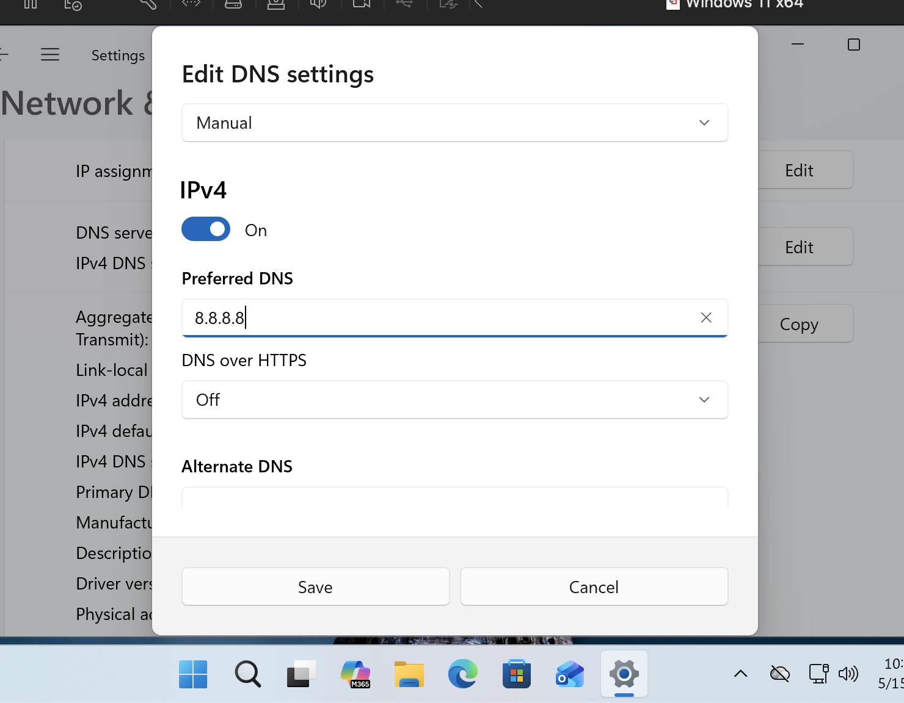
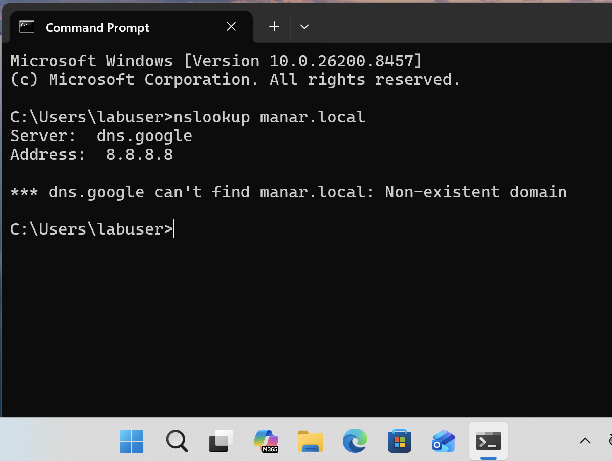
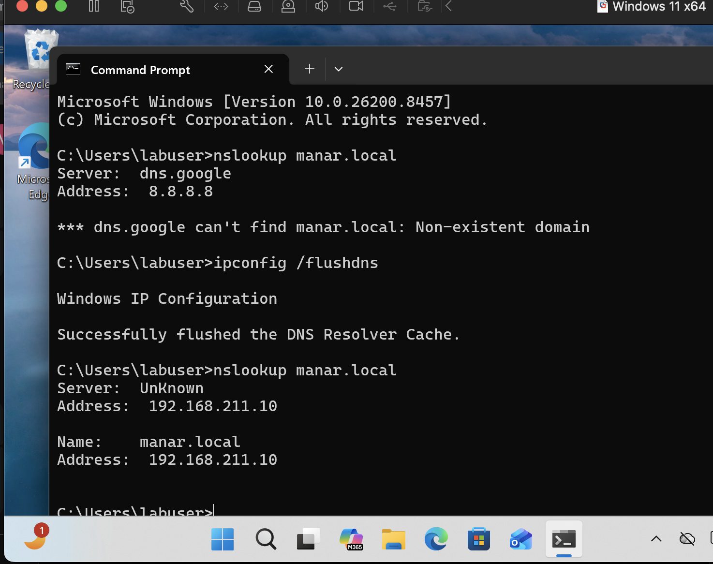
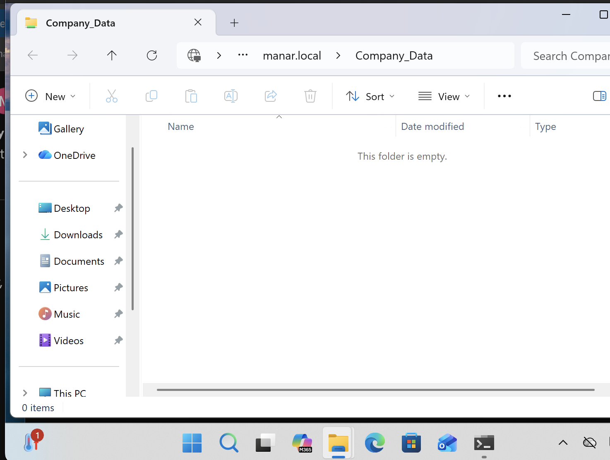
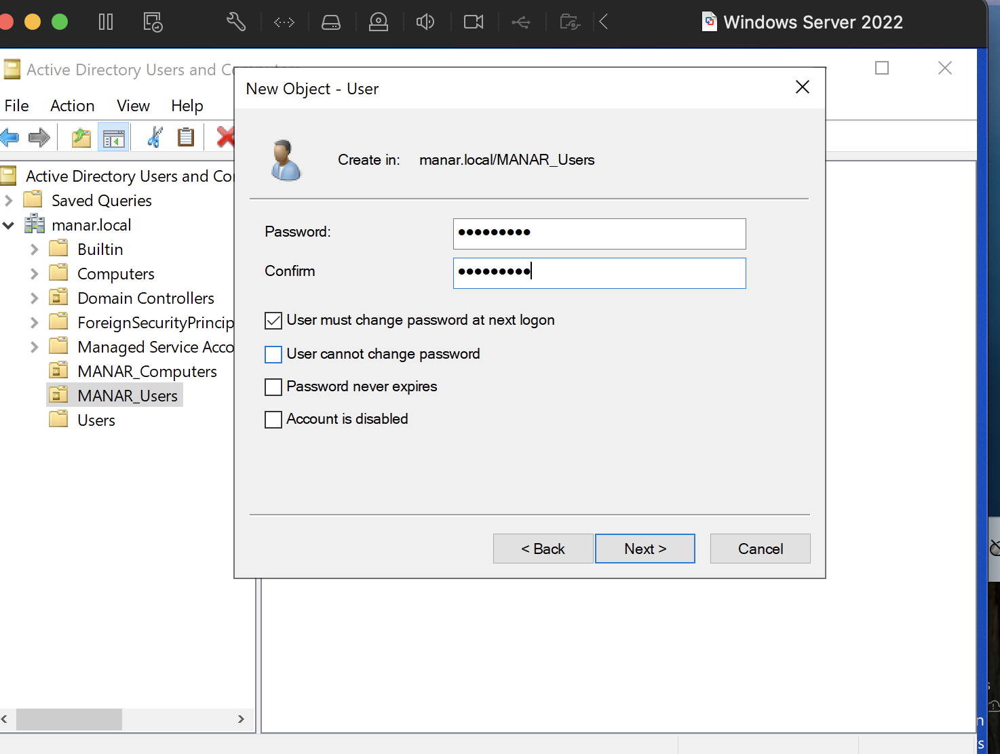
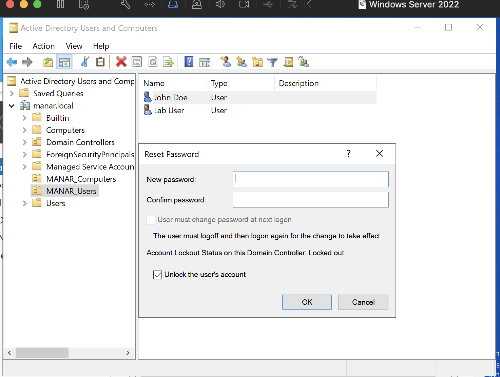
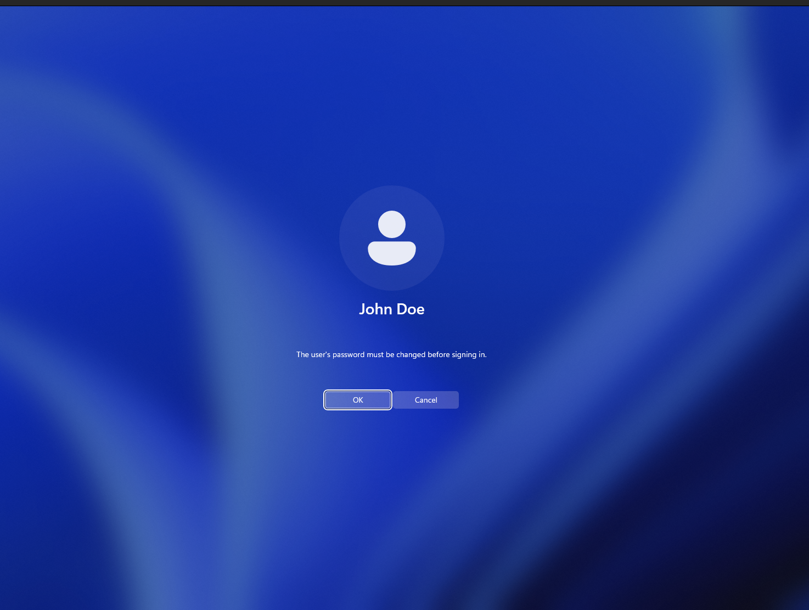
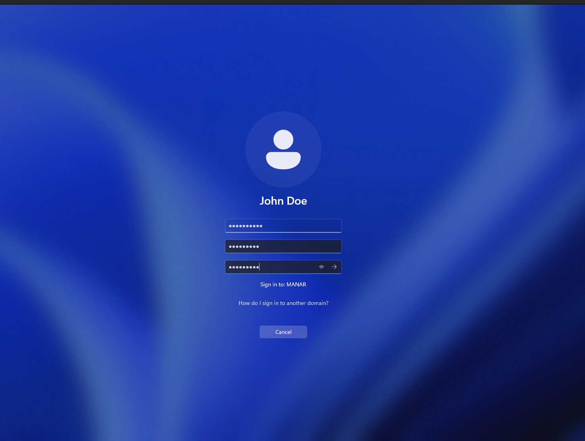

# Troubleshooting-Lab
A collection of real-world corporate IT support scenarios, enterprise diagnostics, and system administration tickets resolved within a virtualized Active Directory environment (`manar.local`)

## Ticket #1 IT Help Desk Simulation: DNS Misconfiguration & Active Directory Disconnect

### **Problem Description**
A help desk ticket was submitted indicating the user could no longer access the corporate network share `\\manar.local\Company_Data`. Standard connectivity tests (pinging by IP) worked, but connecting to the share by domain name was failing with a "network path not found" error.

---

### **Investigation & Diagnosis**

**Step 1: Check Current DNS Configuration**
We started by verifying how the client machine was configured to handle name resolution.

Upon inspecting the IPv4 settings, we discovered the issue. The DNS assignment was set to "Manual", and the **Preferred DNS** was configured with Google's public DNS address (`8.8.8.8`) instead of the required internal Domain Controller IP.

**Step 2: Confirm Name Resolution Failure**
To confirm this configuration was the culprit, we used the `nslookup` tool.

The terminal output confirms the diagnosis. The command `nslookup manar.local` was routed to `dns.google` at `8.8.8.8`. Since Google has no record of the internal private domain, the lookup failed with **"Non-existent domain"**. This verified that the Active Directory Domain Controller could not be located by the client.

---

### **Resolution Steps**

We took the following corrective actions to restore service:

**Step 1: Correct DNS Adapter Settings**
On the Windows 11 client, the network adapter properties were adjusted:
* IPv4 DNS Assignment reverted from Manual `8.8.8.8` to the static IP of the **manar.local** Domain Controller: `192.168.211.10`.

**Step 2: Flush and Verify Cache**
To ensure the correct settings took effect immediately, the local DNS cache was flushed, followed by verification.

In this screenshot, you can see the sequence of successful remediation:
1.  **`ipconfig /flushdns`** was executed to wipe the stale Google lookup data.
2.  A second **`nslookup manar.local`** was performed. This time, the server utilized is the Domain Controller (`192.168.211.10`), and the domain name correctly resolved.

**Step 3: Final Service Verification**
The final step was verifying access to the network resources.

With the domain name resolving correctly, navigating to `\\manar.local\Company_Data` was instantaneous and successful, revealing the contents of the share (currently an empty test folder).

**Ticket Status: Resolved.**

---

## Ticket #2: Account Lockout & Security Policy Remediation

### **Problem Statement**
User `jdoe` reported being unable to log into their Windows 11 workstation. Initial investigation confirmed the user was receiving an official Active Directory lockout notification due to multiple failed login attempts.

---

### **Investigation & Diagnosis**

**Step 1: Client-Side Confirmation**
Attempted login on the Windows 11 VM confirmed the account was locked at the Domain Controller level. The system refused all credential entries, even if correct, due to the security flag.

**Step 2: Server-Side Verification**
Accessed **Active Directory Users and Computers** on the Windows Server 2022 Domain Controller. We navigated to the `MANAR_Users` OU to inspect the account properties for John Doe.

The "Reset Password" dialog explicitly confirmed the status: **"Account Lockout Status on this Domain Controller: Locked out"**.

---

### **Resolution Steps**

**Step 1: Administrative Unlock & Reset**
To restore access, we performed a manual intervention:
1. Triggered the **Reset Password** utility for the affected user.
2. Selected the **"Unlock the user's account"** checkbox to clear the Active Directory lockout bit.
3. Enabled **"User must change password at next logon"** to maintain security integrity.

**Step 2: Forced Password Update**
Upon the next login attempt, the Windows 11 client recognized the "Must Change Password" flag. 

**Step 3: Verification of Success**
The user successfully defined a new complex password and was granted access to the desktop environment. 

**Ticket Status: RESOLVED**
